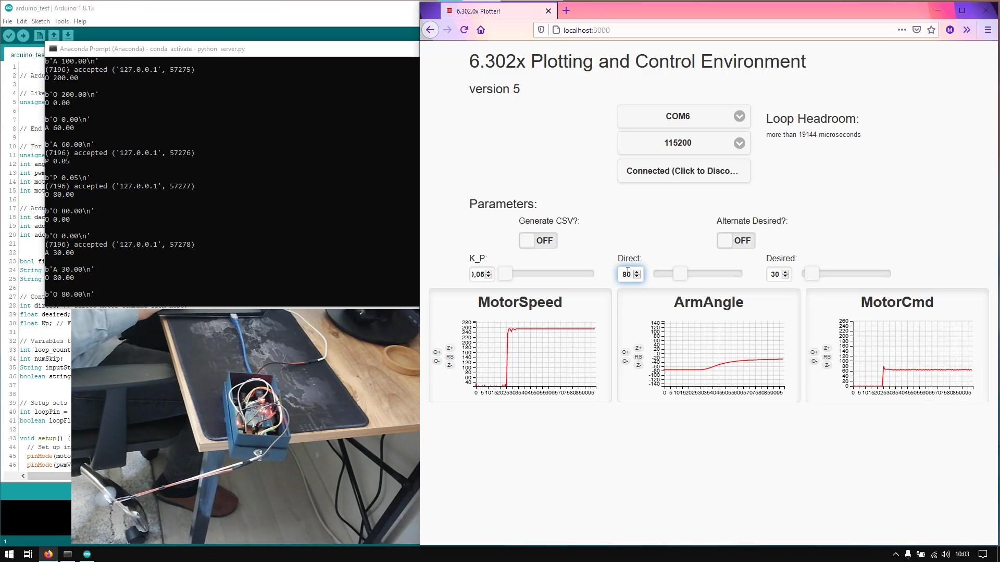

# Digital Control Systems

There are **2 matlab codes** and a **PID** (Proportional Integral Derivative) [project](MIT-PID-Project) from MIT.

### :star: MATLAB Codes 
- [Transfer Function](P1-TransferFunction.m)

- [Stability of System](P2-StabilityOfSystem.m)

### :star: [PID Project](MIT-PID-Project)

