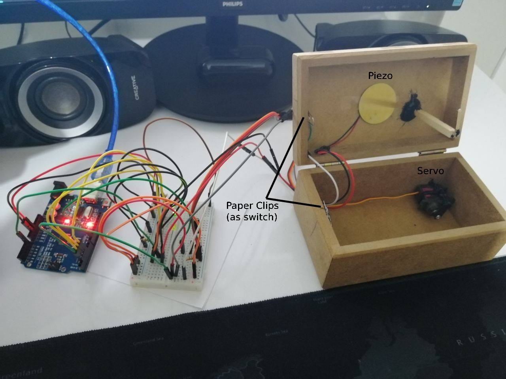

# :star: Projects for Embedded System Design Course

## :one: [Knock Detect Lock](knock-detect-lock)

:white_check_mark: Detecs patterns of knocks and triggers a motor to unlock the box if it the pattern is correct.

:white_check_mark: User must define pattern.

:white_check_mark: Pattern consists of each knock. For example; "happy birthday to you" song consists `6 knocks`.

## :two: Traffic Lights Simulator

- ### :two:.:one: [Arduino UNO](traffic-lights-simulator/ArduinoUNO)

  

- ### :two:.:two: [TivaC](traffic-lights-simulator/TivaC)

  
