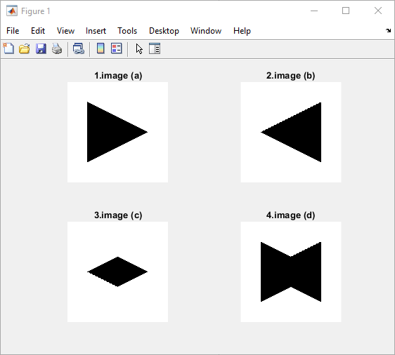
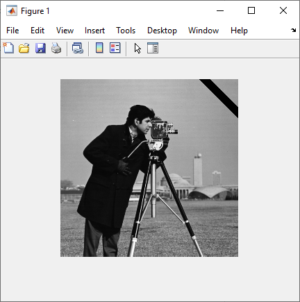
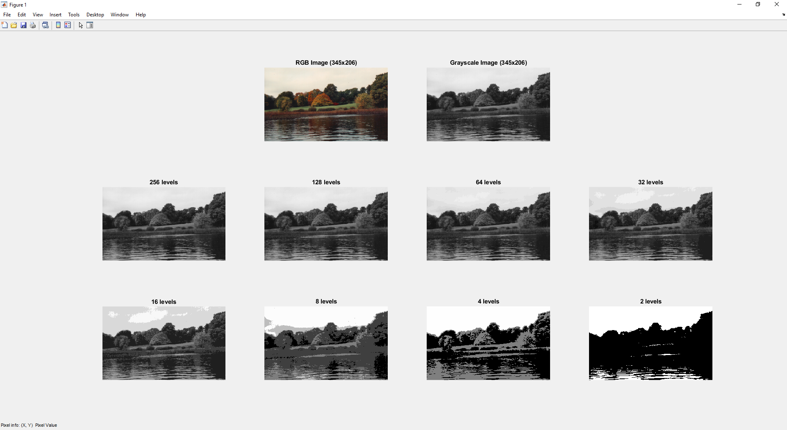
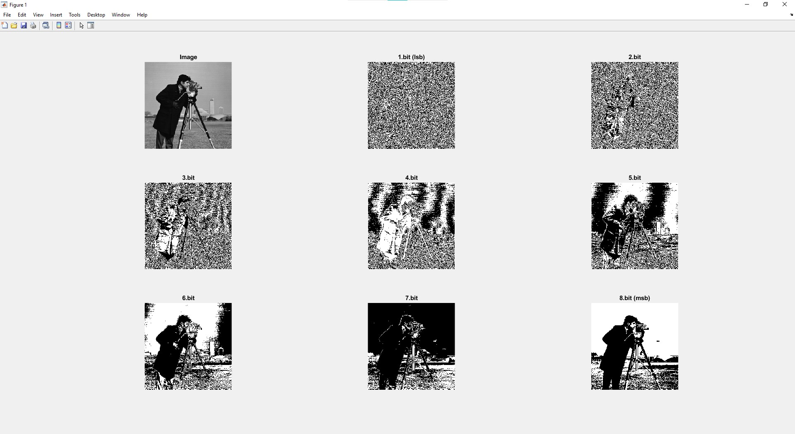
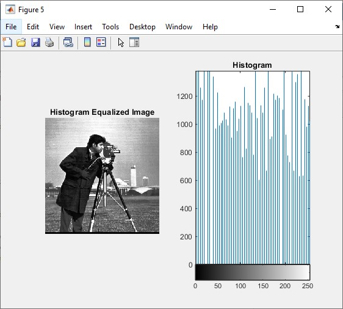
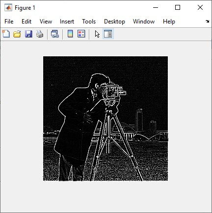
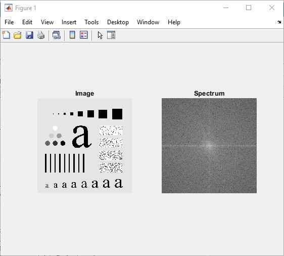
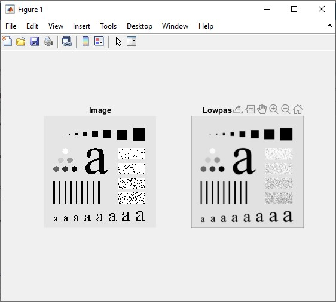

## Image Processing MATLAB Homeworks & Project

### [Q1 - Shapes](Q1-Shapes.m)

### [Q2 - Corner Strip](Q2-CornerStrip.m)

### [Q3 - Levelling](Q3-Leveling.m)

### [Q4 - Bitplane](Q4-Bitplane.m)

### [Q5 - Streching And Equalization](Q5-StretchingAndEqualization.m)

### [Q6 - Spatial Filtering](Q6-SpatialFiltering.m)

### [Q7 - Fourier Spectrum](Q7-FourierSpectrum.m)

### [Q8 - Lowpass Filtering](Q8-LowpassFiltering.m)

