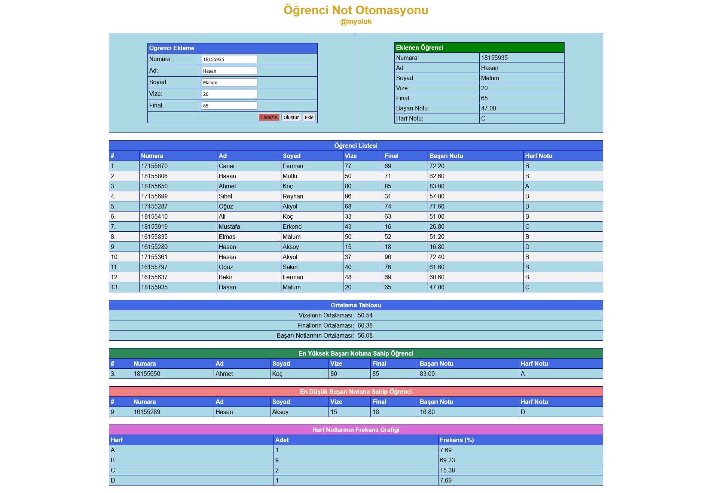
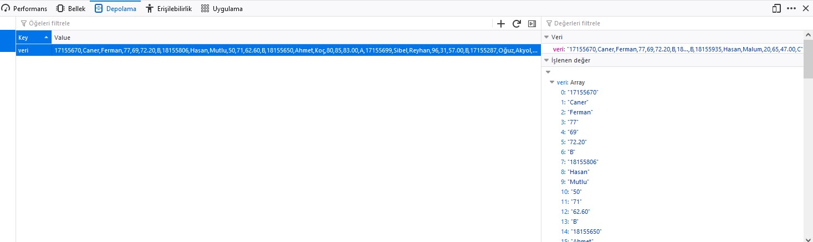

# :stars: Javascript tabanlı Öğrenci Not Otomasyon

:white_check_mark: Öğrenci oluşturma, ekleme, listeleme yapar. 

:white_check_mark: Ortalama, en yüksek/en düşük başarı notu ve notların frekans grafiğini gösterir. 

:point_right: Verileri yerel depo haricinde text (.txt), excel (.xlsx), database (.sql) olarak kaydetmek ve açmak için **Save Data** klasöründeki ilgili dosyalar kullanılmalıdır.

### Ekran Görüntüsü

> Veriler, tarayıcının yerel deposuna (local storage) kaydedilir.

